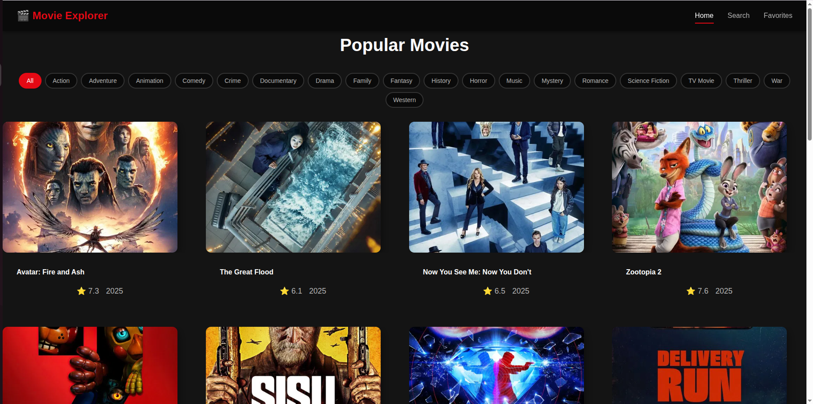
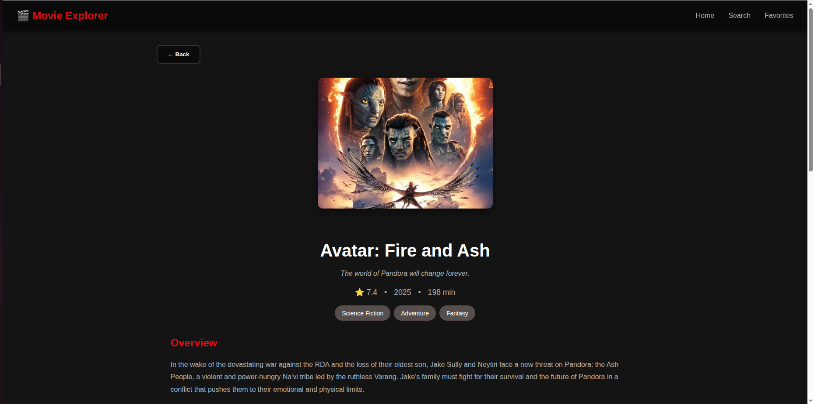
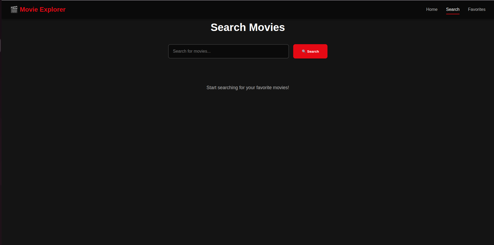

# 🎬 Movie Explorer

A modern, responsive web application for discovering, searching, and managing your favorite movies using real-time data from The Movie Database (TMDB) API.


## 🌟 Live Demo

**[View Live Application →](https://movie-explorer-eight-roan.vercel.app)**

---

## 📋 Table of Contents

- [Project Description](#-project-description)
- [Main Features](#-main-features)
- [API Used](#-api-used)
- [Tech Stack](#-tech-stack)
- [Installation & Setup](#-installation--setup)
- [How to Run Locally](#-how-to-run-locally)
- [Project Structure](#-project-structure)
- [Known Limitations](#-known-limitations)
- [Screenshots](#-screenshots)
- [Future Enhancements](#-future-enhancements)
- [Contributing](#-contributing)
- [License](#-license)

---

## 📖 Project Description

**Movie Explorer** is a full-featured movie discovery platform that allows users to:
- Browse thousands of popular movies
- Search for specific titles
- Filter movies by genre
- View detailed information including cast, trailers, and ratings
- Save favorite movies with personal notes
- Manage a personalized collection of favorites

This application solves the problem of **movie discovery overload** by providing a clean, intuitive interface to explore movies, make informed watching decisions, and keep track of films you want to watch or have enjoyed.

---

## ✨ Main Features

### 🎯 Core Functionality

1. **Movie Discovery**
    - Browse popular movies with infinite scroll
    - Filter by 19+ different genres
    - Real-time data from TMDB API
    - High-quality movie posters and backdrops

2. **Advanced Search**
    - Search across TMDB's entire movie database
    - Real-time search results
    - Pagination support for extensive results

3. **Detailed Movie Information**
    - Complete movie details (title, rating, runtime, release date)
    - Official trailers embedded from YouTube
    - Cast and crew information
    - Genre tags and overview

4. **Favorites Management**
    - Add movies to personal favorites list
    - Write custom notes for each favorite (5-500 characters)
    - Edit notes anytime
    - Remove movies from favorites
    - Persistent storage using MockAPI

5. **Responsive Design**
    - Mobile-first approach
    - Works seamlessly on desktop, tablet, and mobile devices
    - Smooth animations and transitions
    - Modern, Netflix-inspired UI

---

## 🔌 API Used

### The Movie Database (TMDB) API

**Official Documentation:** [https://developer.themoviedb.org/docs](https://developer.themoviedb.org/docs)

**Why TMDB?**
- ✅ Comprehensive movie database with 500,000+ titles
- ✅ High-quality images and metadata
- ✅ Free tier with generous rate limits (50 requests/second)
- ✅ Well-documented RESTful API
- ✅ Active community and reliable uptime
- ✅ Includes trailers, cast info, and user ratings

**Key Endpoints Used:**
- `GET /movie/popular` - Popular movies
- `GET /search/movie` - Search movies
- `GET /movie/{id}` - Movie details
- `GET /genre/movie/list` - Genre list
- `GET /discover/movie` - Filter by genre

### MockAPI.io

**Official Documentation:** [https://mockapi.io/docs](https://mockapi.io/docs)

**Purpose:** Persistent storage for user favorites

**Why MockAPI?**
- ✅ Quick setup for prototyping
- ✅ RESTful CRUD operations
- ✅ No backend development required
- ✅ Free tier sufficient for development

---

## 🛠 Tech Stack

### Frontend Framework & Libraries
- **React 18.2** - UI library with hooks
- **React Router DOM 6.20** - Client-side routing
- **Axios 1.6** - HTTP client for API requests

### Build Tools & Development
- **Vite 5.0** - Fast build tool and dev server
- **ESLint** - Code quality and consistency

### Styling
- **CSS3** - Custom styling with CSS variables
- **Responsive Design** - Mobile-first approach
- **CSS Grid & Flexbox** - Modern layout techniques

### APIs & Services
- **TMDB API** - Movie data and images
- **MockAPI.io** - Favorites persistence
- **YouTube Embed API** - Trailer playback

---

## 📦 Installation & Setup

### Prerequisites

Before you begin, ensure you have the following installed:
- **Node.js** (v14 or higher) - [Download](https://nodejs.org/)
- **npm** (comes with Node.js) or **yarn**
- **Git** - [Download](https://git-scm.com/)

### 1. Clone the Repository

```bash
git clone https://github.com/yourusername/movie-explorer.git
cd movie-explorer
```

### 2. Install Dependencies

```bash
npm install
```

### 3. Get TMDB API Key

1. Go to [https://www.themoviedb.org/signup](https://www.themoviedb.org/signup)
2. Create a free account
3. Navigate to Settings → API
4. Request an API key (free)
5. Copy your API key

### 4. Setup MockAPI

1. Go to [https://mockapi.io](https://mockapi.io)
2. Create a new project
3. Create a resource named **"favorites"** with the following schema:
   ```json
   {
     "movieId": "number",
     "title": "string",
     "poster": "string",
     "note": "string",
     "rating": "number",
     "createdAt": "date"
   }
   ```
4. Copy your project URL (e.g., `https://675a1234567890abcdef1234.mockapi.io/api/v1`)

### 5. Configure Environment Variables

Create a `.env` file in the root directory:

```env
VITE_TMDB_API_KEY=your_tmdb_api_key_here
```

### 6. Update MockAPI URL

Open `src/config/api.config.js` and update the `MOCK_API_URL`:

```javascript
export const MOCK_API_URL = 'https://your-mockapi-url.mockapi.io/api/v1';
```

---

## 🚀 How to Run Locally

### Development Mode

```bash
npm run dev
```

The application will start at `http://localhost:5173`

### Production Build

```bash
npm run build
```

Build output will be in the `dist/` directory.

### Preview Production Build

```bash
npm run preview
```

---

## 📁 Project Structure

```
movie-explorer/
├── public/                 # Static assets
├── src/
│   ├── components/         # Reusable UI components
│   │   ├── ErrorMessage.jsx
│   │   ├── FavoriteForm.jsx
│   │   ├── FilterGenres.jsx
│   │   ├── Loading.jsx
│   │   ├── MovieCard.jsx
│   │   ├── MovieList.jsx
│   │   ├── Navbar.jsx
│   │   └── SearchBar.jsx
│   ├── config/            # Configuration files
│   │   └── api.config.js  # API URLs and settings
│   ├── hooks/             # Custom React hooks
│   │   ├── useFavorites.js
│   │   └── useMovies.js
│   ├── pages/             # Page components
│   │   ├── FavoritesPage.jsx
│   │   ├── HomePage.jsx
│   │   ├── MovieDetailsPage.jsx
│   │   └── SearchPage.jsx
│   ├── services/          # API service modules
│   │   ├── favoritesApi.js
│   │   └── tmdbApi.js
│   ├── utils/             # Utility functions
│   │   └── validation.js
│   ├── App.jsx            # Main app component
│   ├── App.css            # Component styles
│   ├── main.jsx           # React entry point
│   └── index.css          # Global styles
├── .env                   # Environment variables (create this)
├── .gitignore            # Git ignore rules
├── index.html            # HTML entry point
├── package.json          # Dependencies
├── vite.config.js        # Vite configuration
└── README.md             # This file
```

---

## ⚠️ Known Limitations

### Technical Limitations

1. **Rate Limiting**
    - TMDB API: Limited to 50 requests/second on free tier
    - May experience delays during high traffic

2. **Browser Storage**
    - Favorites stored on MockAPI (not local storage)
    - Requires internet connection to persist favorites

3. **Image Loading**
    - High-resolution images may load slowly on poor connections
    - No offline image caching implemented

4. **Search Results**
    - Limited to 10,000 results per query (TMDB limitation)
    - No autocomplete for search queries

### Feature Limitations

1. **User Authentication**
    - No user login system implemented
    - Favorites are global (shared MockAPI resource)
    - In production, would need user-specific storage

2. **Advanced Filtering**
    - Cannot filter by multiple genres simultaneously
    - No year range or rating filters

3. **Social Features**
    - No sharing capabilities
    - No user reviews or ratings

4. **Offline Support**
    - Requires active internet connection
    - No Progressive Web App (PWA) features

### Future Considerations

- Implement user authentication (Firebase/Auth0)
- Add watchlist separate from favorites
- Include TV shows alongside movies
- Add recommendation engine
- Implement pagination instead of infinite scroll
- Add sort options (by rating, date, popularity)

---

## 📸 Screenshots

### Home Page - Popular Movies



### Movie Details Page



### Search Page



### Favorites Page


---

## 🚀 Future Enhancements

### Planned Features

- [ ] User authentication and profiles
- [ ] Personalized recommendations
- [ ] Watch history tracking
- [ ] Movie ratings and reviews
- [ ] Social sharing features
- [ ] Dark/Light theme toggle
- [ ] Advanced search filters
- [ ] TV shows support
- [ ] Mobile app (React Native)
- [ ] Offline mode with service workers

---

## 🤝 Contributing

Contributions are welcome! If you'd like to improve Movie Explorer:

1. Fork the repository
2. Create a feature branch (`git checkout -b feature/AmazingFeature`)
3. Commit your changes (`git commit -m 'Add some AmazingFeature'`)
4. Push to the branch (`git push origin feature/AmazingFeature`)
5. Open a Pull Request

---

## 📄 License

This project is licensed under the MIT License - see the [LICENSE](LICENSE) file for details.

---

## 👤 Author

**Your Name**
- GitHub: [@yourusername](https://github.com/yourusername)
- LinkedIn: [Your Name](https://linkedin.com/in/yourprofile)
- Email: your.email@example.com

---

## 🙏 Acknowledgments

- [The Movie Database (TMDB)](https://www.themoviedb.org/) for providing the comprehensive movie API
- [MockAPI.io](https://mockapi.io/) for simple backend prototyping
- [React](https://react.dev/) team for the amazing framework
- [Vite](https://vitejs.dev/) for the blazing fast build tool
- Course instructors and peers for guidance and feedback

---

## 📞 Support

If you encounter any issues or have questions:

1. Check the [Issues](https://github.com/yourusername/movie-explorer/issues) page
2. Create a new issue with detailed description
3. Contact via email: your.email@example.com

---

**Made with ❤️ and ☕ for the Web Development Course**

⭐ Star this repository if you found it helpful!